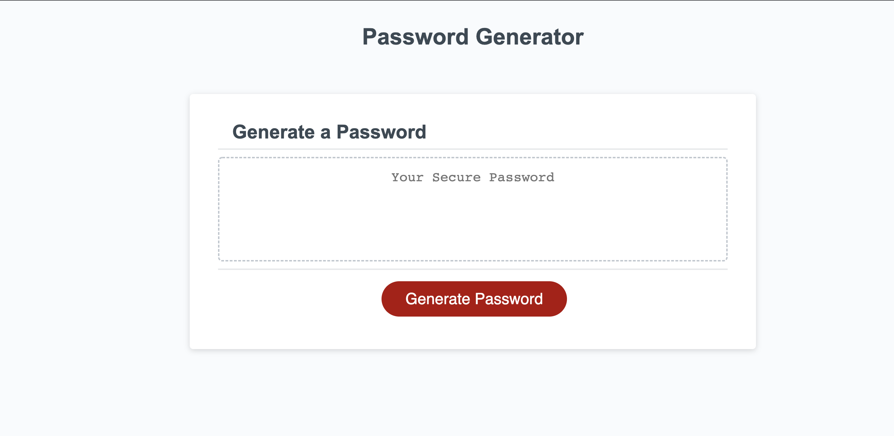

# Password Generator

This is a browser based app that uses JavaScript to generate a random, secure password for the user based on the criteria they select.

This project has been deployed to GitHub Pages. You can follow the deployment link. Or, download the sources files from GitHub and run them locally.

* [GitHub Repository](https://github.com/iamjoyfulgirl/password-generator)
* [Deployed GitHub IO](https://iamjoyfulgirl.github.io/password-generator)
* [Full Demo Video](https://drive.google.com/file/d/164A8yYYAOdkg-xRkWsx-K4PrPyuNDn05/view)



## Acceptance Criteria
```
GIVEN I need a new, secure password
WHEN I click the button to generate a password
THEN I am presented with a series of prompts for password criteria
WHEN prompted for password criteria
THEN I select which criteria to include in the password
WHEN prompted for the length of the password
THEN I choose a length of at least 8 characters and no more than 128 characters
WHEN asked for character types to include in the password
THEN I confirm whether or not to include lowercase, uppercase, numeric, and/or special characters
WHEN I answer each prompt
THEN my input should be validated and at least one character type should be selected
WHEN all prompts are answered
THEN a password is generated that matches the selected criteria
WHEN the password is generated
THEN the password is either displayed in an alert or written to the page
```

## Author
* **Sherri Knight** - [Git Hub Profile](https://github.com/iamjoyfulgirl)
